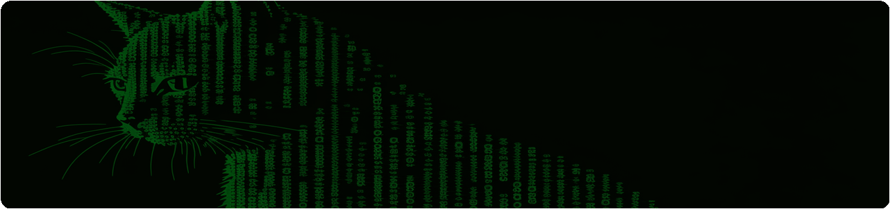

<!-- 전체 컨테이너 -->

  <!-- Bo's GitHub Stats 카드 -->
  

  <!-- Most Used Languages 카드 -->
  

<!-- Gitbook 카드 -->

<!-- Activity Graph -->

<!--
**invisible-bo/invisible-bo** is a ✨ _special_ ✨ repository because its `README.md` (this file) appears on your GitHub profile.

Here are some ideas to get you started:

- 🔭 I’m currently working on ...
- 🌱 I’m currently learning ...
- 👯 I’m looking to collaborate on ...
- 🤔 I’m looking for help with ...
- 💬 Ask me about ...
- 📫 How to reach me: ...
- 😄 Pronouns: ...
- ⚡ Fun fact: ...
->